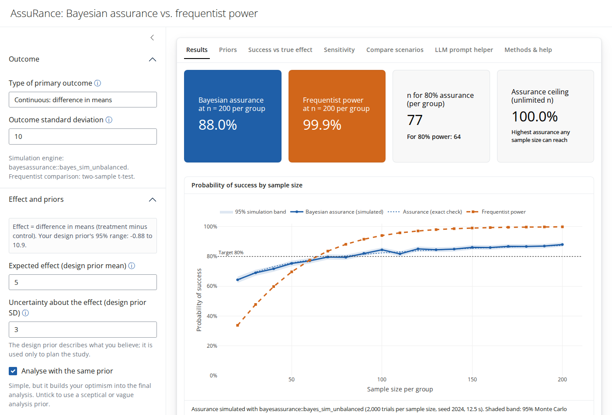
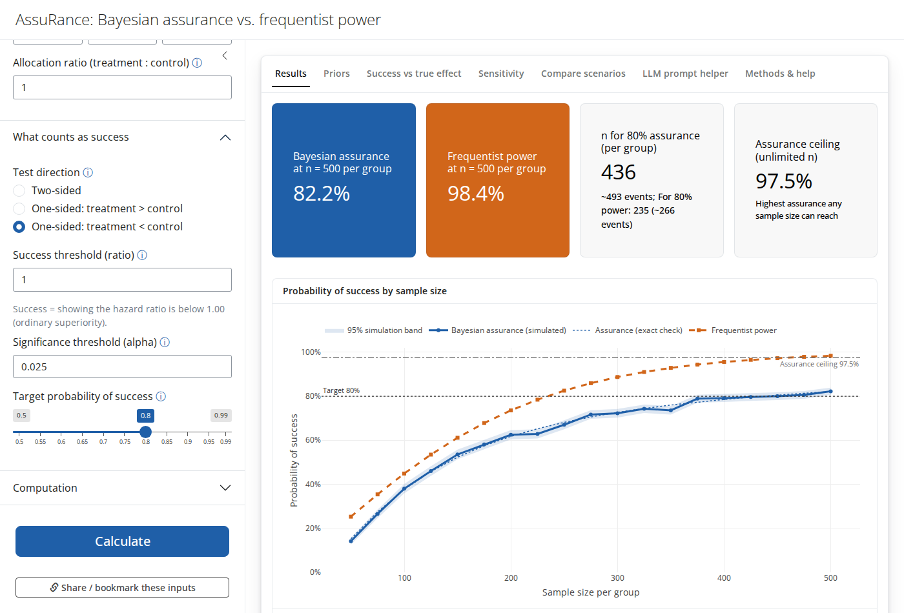
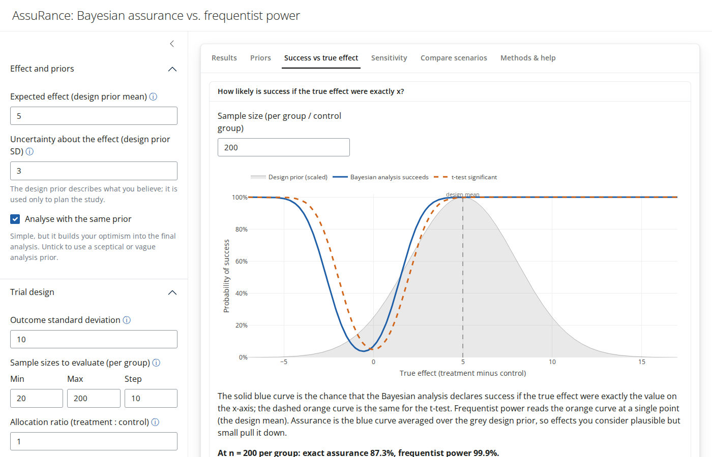

# AssuRance

**Bayesian assurance vs. frequentist power for two-arm clinical trials with
continuous, baseline-adjusted, binary or time-to-event outcomes.**

> **Live app:** <https://01a0e0e5-a13b-f83c-6ee7-a0c5d03109e8.share.connect.posit.cloud/>
>
> **Guide (English / Português):** <https://drhrf.github.io/AssuRance/>, an
> illustrated, educational walkthrough of the ideas and the app, with an
> interactive demo.

AssuRance helps you choose a sample size by comparing two ways of asking "how
likely is this trial to succeed?":

- **Frequentist power** assumes the treatment effect is known exactly.
- **Bayesian assurance** (also called the probability of success) averages the
  chance of success over every effect size you consider plausible.

For continuous outcomes the simulations run on the
[`bayesassurance`](https://github.com/jpan928/bayesassurance_rpackage) R
package. Binary and time-to-event outcomes use the app's own simulators, for
the reasons given under [Method notes](#method-notes).



## Features

- **English and Portuguese (Brazil).** A button in the top-right corner
  switches the whole interface, including results, plots, tables, messages
  and the downloadable report, with Portuguese number formats (decimal
  comma). The choice is remembered, Portuguese-language browsers start in
  Portuguese, and `?lang=pt` or `?lang=en` in the URL forces a language.

- **Four outcome types:**

  | Outcome | Effect measure | Extra inputs |
  | --- | --- | --- |
  | Continuous | difference in means | outcome SD |
  | Continuous, adjusted for baseline (ANCOVA) | adjusted difference in means | outcome SD, baseline-outcome correlation |
  | Binary | odds ratio, risk ratio or risk difference | control-group event rate |
  | Time to event | hazard ratio | control median, recruitment period, follow-up, loss to follow-up |

  Priors on ratios are entered as a plausible 95% range, such as "the hazard
  ratio is between 0.6 and 1.0". For time-to-event and binary outcomes the
  app also reports the **expected number of events**.
- **Separate design and analysis priors.** The design prior is what you
  believe and is used to simulate trials. The analysis prior is what the final
  analysis will use. You can make them identical with one click.
- **Assurance and power curves** across a range of sample sizes, with a
  target line and 95% Monte Carlo bands for the simulated values.
- **Two engines.** Simulation of virtual trials is the default; the exact
  engine is instant and can also be overlaid as a check.
  - **Simulation:** continuous outcomes run through
    `bayesassurance::bayes_sim_unbalanced()`, including a full ANCOVA
    regression with a simulated baseline covariate. Binary outcomes simulate
    binomial counts, and time-to-event outcomes simulate patient-level
    survival data with staggered recruitment and censoring.
  - **Exact:** uses closed-form formulas, or numerical integration for binary
    and time-to-event outcomes.
- **Sample-size finder.** It finds the smallest sample size that reaches your
  target assurance or power. It also shows the **assurance ceiling**, the
  highest assurance any sample size can reach, and tells you when your target
  is out of reach.
- **Flexible success rule.** You can use one- or two-sided tests. The
  success threshold can require a clinically meaningful effect, or set up a
  **non-inferiority** design, for example showing a hazard ratio below 1.3.
- **Safety checks.** The app warns you when the analysis prior alone would
  already declare success, which typically happens when an optimistic design
  prior is reused for the analysis. It also warns when a risk-ratio or
  risk-difference prior implies impossible event rates.
- **Unequal allocation** (for example, 2:1) and **dropout**: the app reports
  how many people to enrol.
- **A plain-language summary** for non-statisticians. It flags a gap of more
  than 15 percentage points between assurance and power, and for two-sided
  tests it notes how much of the "success" is a finding in the unexpected
  direction.
- **Detectability tab.** It asks how easily the trial would detect a true
  effect, meaning one beyond the success threshold. The headline is
  **detection if real**: the probability of success given that the effect is
  real, which separates "the trial is too small" from "the treatment might not
  work". The tab also breaks down how the trial could end, and gives Shannon
  measures in bits: outcome entropy (how predictable the result is) and
  mutual information (how much the result teaches you about whether the
  effect is real, and about its size).
- **Priors tab.** It shows your design and analysis priors and the effects
  that count as a success.
- **Success vs true effect tab.** It shows how assurance averages the success
  probability over the design prior.
- **Sensitivity tab.** Heat map of assurance across design priors, a curve
  of assurance against the analysis-prior SD, and a curve against the
  outcome-specific assumption: the outcome SD, the baseline correlation, the
  control-group event rate or the control-group median survival.
- **Compare scenarios.** Save up to 8 runs, even with different outcome
  types, and overlay them.
- **Downloads and sharing.** CSV table, PNG plot, a text report, and a
  bookmark link that restores all inputs.
- **LLM prompt helper.** Describe your project (condition, intervention,
  outcome and so on). The app writes a prompt for an AI assistant, ideally
  one that can search the web, asking it to research evidence-based values
  for every input, show its sources and conversions, and end with a JSON
  block. Paste the answer back and the app fills in its inputs, skipping any
  value that isn't valid. Always check the numbers and references it gives.
- A **Methods & help** tab with formulas and references.





## Run it locally (RStudio)

1. **Get the code.** In RStudio, go to *File → New Project → Version Control
   → Git*. Enter `https://github.com/drhrf/AssuRance.git` as the repository
   URL, choose a folder and click *Create Project*. (From a terminal you can
   instead run `git clone https://github.com/drhrf/AssuRance.git`, then open
   `AssuRance.Rproj`.)
2. **Install the packages.** Run this once in the RStudio console:
   ```r
   source("setup.R")
   ```
   It installs `shiny`, `bslib`, `plotly`, `ggplot2`, `DT`, `rsconnect` and
   `bayesassurance`. If `bayesassurance` isn't available on CRAN, it installs
   it from GitHub instead.
3. **Run the app.** Open `app.R` and click **Run App**, or run
   `shiny::runApp()`.
4. **Get updates later.** Open the *Git* tab (top-right pane) and click
   **Pull**.

## Publish on Posit Cloud

1. Sign in at [posit.cloud](https://posit.cloud) and open *Your Workspace*.
2. Click **New Project → New Project from Git Repository**, paste
   `https://github.com/drhrf/AssuRance`, and click **OK**. Posit Cloud clones
   the repository and opens it in RStudio in your browser.
3. In the console, run `source("setup.R")`. This takes a few minutes the first
   time.
4. Open `app.R` and click **Run App** to check that it works.
5. With `app.R` open, click the blue **Publish** icon at the top right of the
   editor pane. In a Posit Cloud project, the dialog is already set up to
   publish to Posit Cloud.
   - Make sure `app.R` and every file in the `R/` folder are ticked. `tests/`,
     `docs/`, `setup.R` and this README aren't needed (a `.rscignore` file
     leaves them out).
   - Give it a title, such as *AssuRance*, and click **Publish**.
6. Once it has deployed, the app appears under **Content** in the same space.
   To make it public, open the app's **Settings → Access**, choose **Anyone**
   (no login required), and copy the URL.

**Updating the published app.** Pull the latest code (*Git* tab → **Pull**),
then click **Publish** again and choose the existing deployment. The URL stays
the same.

**Notes**

- The free Posit Cloud plan has limited monthly compute hours and memory, and
  apps go to sleep when idle, so the first visit after a break can take a
  few seconds.
- The simulation engine gets slower as sample sizes grow (its cost scales with
  the square of the sample size). The sidebar shows an estimated run time,
  and the app refuses jobs estimated at over 15 minutes. While a simulation
  runs, a progress box with a **Stop run** button appears, and the rest of
  the app stays usable. For quick exploration, use the exact engine.
- If publishing fails with an error about `bayesassurance`'s source, reinstall
  it from GitHub with
  `remotes::install_github("jpan928/bayesassurance_rpackage")`, restart R,
  and publish again.

## The guide website

The bilingual guide lives in `docs/index.html`: a single self-contained page
with no build step, and screenshots in `docs/img/`. To publish it with GitHub
Pages, go to the repository's **Settings → Pages**, choose **Deploy from a
branch**, select the default branch and the **/docs** folder, and save. The
live-app button reads the `APP_URL` constant at the bottom of the page.

## Files

| File | Purpose |
| --- | --- |
| `app.R` | Server logic |
| `R/ui_sidebar.R`, `R/ui_tabs.R` | User interface: sidebar inputs, and the main panel and tabs |
| `R/calculations.R` | Outcome-agnostic engine: success rule, exact assurance, power, sample-size finder, chunked simulation, and the documented mapping onto `bayesassurance`'s parameters |
| `R/models.R` | One model per outcome type: variances, simulators, power, labels |
| `R/summary_text.R` | Plain-language summary |
| `R/plots.R` | Plot builders (plotly for the screen, ggplot2 for PNG export) |
| `R/methods_ui.R` | Content of the *Methods & help* tab |
| `R/prompt_generator.R` | Builds the prompt for the LLM helper and reads its JSON answer |
| `R/detectability.R` | Detection if real, outcome breakdown and Shannon information measures |
| `R/i18n.R` | English / Portuguese interface: translation helpers and the language toggle |
| `tests/test_calculations.R` | Checks the `bayesassurance` simulation against the exact formula, power against `power.t.test`, and the chunked simulation |
| `tests/test_models.R` | Checks simulation against exact assurance for every outcome type, plus the survival and binary building blocks |
| `tests/test_prompt_generator.R` | Checks the prompt builder and the JSON answer parser |
| `tests/test_detectability.R` | Checks the detectability measures, including against a direct simulation |
| `tests/test_i18n.R` | Checks that every text has a Portuguese version, number formats, and that all plots build in both languages |
| `setup.R` | Installs the required packages |

Run the tests from the project folder with `Rscript tests/test_calculations.R`
(about a minute), `Rscript tests/test_models.R` (about 10 seconds) and
`Rscript tests/test_prompt_generator.R`, `Rscript tests/test_i18n.R` and
`Rscript tests/test_detectability.R` (each a few seconds).

## Method notes

- **Common framework.** Each outcome type is reduced to an effect θ on a
  scale where its estimate is approximately normal:
  - the difference in means, for continuous outcomes
  - the log odds ratio, log risk ratio or risk difference, for binary outcomes
  - the log hazard ratio, for time-to-event outcomes

  θ has a design prior and an analysis prior. A trial succeeds when the
  posterior probability that θ is beyond the threshold, in the tested
  direction, is greater than 1 − α, or 1 − α/2 per tail for a two-sided test.
- **Variances.**
  - **Continuous:** σ²(1/n<sub>T</sub> + 1/n<sub>C</sub>).
  - **ANCOVA:** the same multiplied by (1 − ρ²), and slightly inflated
    because the slope is estimated.
  - **Binary:** delta-method variances at the true event rates.
  - **Time to event:** 1/D<sub>T</sub> + 1/D<sub>C</sub>, where D is the
    expected number of events. D comes from exponential survival with uniform
    recruitment, administrative censoring and loss to follow-up.

  When the variance depends on θ (binary and time-to-event outcomes), the
  exact engine integrates over the design prior numerically.
- **Package mapping.** `bayesassurance` expresses prior variances relative to
  σ², so a prior SD *s* enters as *s*²/σ². The analysis prior is placed only
  on the treatment–control contrast, with a flat prior on the common level
  (and on the baseline slope, for ANCOVA). `R/calculations.R` spells this out
  step by step.
- **Package functions not used:**
  - **`assurance_nd_na()`** (closed form) ties the analysis prior mean to the
    null value, and doesn't match the exact assurance when the analysis prior
    is informative.
  - **`bayes_sim_betabin()`** (binary) draws the true proportions only once
    per call, so it doesn't average over the design prior.
  - **`bayes_sim_unknownvar()`** builds a covariance matrix of the wrong size
    for two-group designs.
  - The package has no survival functions.
- **Power.** Continuous outcomes use t-test power: two-sample, or ANCOVA with
  N − 3 degrees of freedom, identical to `stats::power.t.test()` for equal
  groups. Binary and time-to-event outcomes use a Wald z-test on the working
  scale.
- **Limitations.** Nuisance values (outcome SD, correlation, control-group
  event rate, control median) are treated as known; the Sensitivity tab shows
  how much they matter. The survival model assumes exponential event times
  and proportional hazards. With very few events, trust the simulation over
  the exact engine.

## References

- O'Hagan A, Stevens JW, Campbell MJ (2005). Assurance in clinical trial
  design. *Pharmaceutical Statistics* 4(3):187–201.
- Ren S, Oakley JE (2014). Assurance calculations for planning clinical
  trials with time-to-event outcomes. *Statistics in Medicine* 33(1):31–45.
- Schoenfeld DA (1983). Sample-size formula for the proportional-hazards
  regression model. *Biometrics* 39(2):499–503.
- Borm GF, Fransen J, Lemmens WA (2007). A simple sample size formula for
  analysis of covariance in randomized clinical trials. *Journal of Clinical
  Epidemiology* 60(12):1234–1238.
- Pan J, Banerjee S (2023). bayesassurance: An R package for calculating
  sample size and Bayesian assurance. *The R Journal*.
  [RJ-2023-066](https://journal.r-project.org/articles/RJ-2023-066/)
